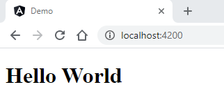
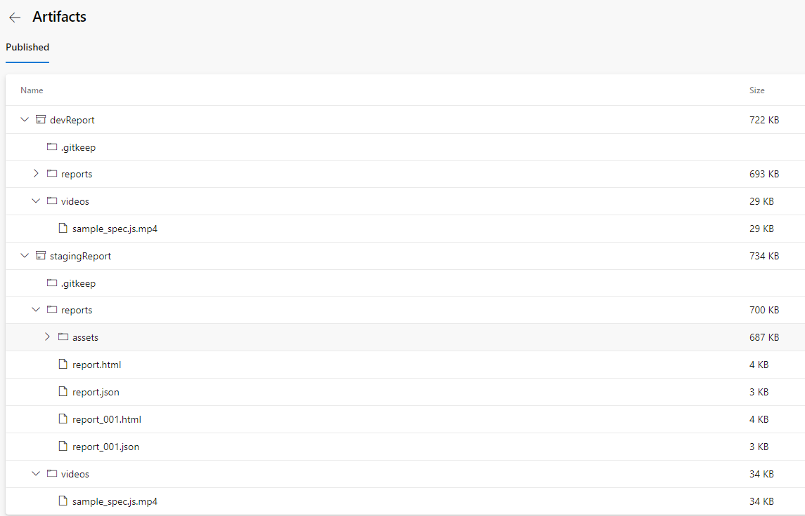

# Cypress with Docker-Compose Demo

## Description
This demo shows, how to prepare the environment for using cypress in pipelines. With docker-compose it's possible to test in development-environment and later in the pipeline in the same isolated way.

The demo is an angular-app. When starting the angular-app, on the screen will be displayed "Hello World". For this page, we add a test, that checks, if the text is displayed.

## Removing protractor and karma
The test-ressources we don't need can be removed:
- Remove the e2e folder with all protractor files
- In angular.json remove all content with protractor and karma

## Adding Cypress
We install cypress in a folder "e2e". Cypress gets an own package.json. The reason is, that cypress doesn't need all dependencies, that are used in the angular-app. When later the tests are running, the build-time is much faster.
- Create Folder "e2e" and navigate in the new folder
- Create package.json with "npm init".
        
        $ npm init
        
        This utility will walk you through creating a package.json file.
        It only covers the most common items, and tries to guess sensible defaults.

        See `npm help init` for definitive documentation on these fields
        and exactly what they do.

        Use `npm install <pkg>` afterwards to install a package and
        save it as a dependency in the package.json file.

        Press ^C at any time to quit.
        package name: (e2e)
        version: (1.0.0)
        description:
        entry point: (index.js)
        test command:
        git repository:
        keywords:
        author:
        license: (ISC)
        About to write to C:\Angular\CypressWithDockerComposeDemo\e2e\package.json:

        {
        "name": "e2e",
        "version": "1.0.0",
        "description": "",
        "main": "index.js",
        "scripts": {
            "test": "echo \"Error: no test specified\" && exit 1"
        },
        "author": "",
        "license": "ISC"
        }

        Is this OK? (yes)

- Adding this line to the .gitignore file
    
  ** **node_modules** **

- $ npm install cypress --save-dev
- $ npm install cypress-mochawesome-reporter --save-dev
- Update the scripts-section in package.json

        "name": "e2e",
        "version": "1.0.0",
        "description": "",
        "main": "index.js",
        "scripts": {
            "e2e": "cypress run"
            },
        "author": "",
        "license": "ISC",
        "devDependencies": {
            "cypress": "^6.1.0",        
            "cypress-mochawesome-reporter": "^1.3.0"
            }
- create the cypress sub-folders with:
  
  $ ./node_modules/.bin/cypress open
- when cypress is not working reinstall with 
  
  npx cypress install --force

- Update cypress.json

        {
            "baseUrl": "http://localhost:4200"
        }

    The baseUrl could be overridden by an environment-variable CYPRESS_baseUrl. In this demo, it happens in the docker-compose.yml file.

- Remove in folder cypress/integration the examples folder
- Add sample_spec.js

        /// <reference types="Cypress" />

        describe('My First Test', () => {
            it('Should display HelloWorld on the Page', () => {
            cy.visit('/');
            cy.get('h1').contains('Hello World');
            });
        });
- $ npm run e2e
  
  The test "MyFirstTest" should be green.
  Gratulations! Cypress is working locally.

## Adding Docker-Support
- Dockerfile Angular-Demo-App

        # Builder
        FROM node:12.20.0-alpine3.10 as builder
        WORKDIR /src
        COPY package.json .
        RUN npm install
        COPY . .
        RUN npm run build

        # Make production build
        FROM node:12.20.0-alpine3.10 as prodBuild
        RUN npm install -g http-server-ssl http-server
        WORKDIR /app
        COPY --from=builder ./src/dist/demo .
        EXPOSE 4200
        CMD [ "http-server", "-p", "4200", "/app" ]

- Dockerfile Cypress

        FROM cypress/included:6.1.0 as e2eBuild
        WORKDIR /e2e
        COPY ./package.json .
        RUN npm install
        COPY . .

        # Run tests
        CMD ["npm", "run", "e2e" ]

- Docker-Compose (in root-folder)

        version: '3.2'
        services:
        frontend:
            build:
                context: .
            expose:
              - 4200
            logging:
                driver: local
        cypress:
            depends_on:
              - frontend
            logging:
                driver: local
            environment:
            # Important!!! The baseUrl can be set with the 
            # docker-compose up command. So it is possible
            # to set an url dynamically in the pipeline.
              - CYPRESS_baseUrl=${baseUrl}
              - CYPRESS_screenshotsFolder=/results/screenshots
              - CYPRESS_videosFolder=/results/videos
            build:
                context: ./e2e
            volumes:
            - type: bind
                source: ./e2e/results
                target: /results
            - type: bind
                source: ./e2e/results
                target: /e2e/results

  In the local dev-environment, the volumes-section offers the possibility to get the test-results in folder /e2e/results.

  A pipeline has access to the test-results in the source-directory in the same path.

- Add .dockerignore files in root folder and e2e folder with content: 

        node_modules

- For the reports, it is important to create a results folder in the e2e folder. In the new empty results-folder, create a .gitkeep file.

    

## Executing docker-compose for running cypress-tests

The commands for executing tests are different between mac and windows.
Here is a common explanation from the web, that helps, to use the correct commands.

    # EnvirionmentVariables to docker-compose up
    MAC / LINUX
    TEST= docker-compose up to create and start both app and db container. The api should then be running on your docker daemon on port 3030.

    TEST=DO docker-compose up to create and start both app and db container. The api should execute the npm run test inside the package.json file.

    WINDOWS (Powershell)
    $env:TEST="";docker-compose up to create and start both app and db container. The api should then be running on your docker daemon on port 3030.

    $env:TEST="do";docker-compose up to create and start both app and db container. The api should execute the npm run test inside the package.json file.

I am working on windows with the git bash. So I am using the LINUX commands for starting the tests.

    $ baseUrl=http://frontend:4200 docker-compose up --exit-code-from cypress --build

### Details to this command
- The baseUrl is a variable in the docker-compose.yml file. Here is the snippet, where it is used:

        environment:
            # Important!!! The baseUrl can be set with the 
            # docker-compose up command. So it is possible
            # to set an url dynamically in the pipeline.
            - CYPRESS_baseUrl=${baseUrl}

- The url http://frontend:4200 navigates to the created service in the docker-compose.yml file, which is the angular-demo-app. In a later scenario, it is possible to use an url, where the angular-app is deployed to. For example a staging-environment.

        version: '3.2'
        services:
            frontend:
                build:
                    context: .
                expose:
                    - 4200

- --exit-code-from cypress

        Generally, after docker-compose up, docker compose runs until someone stopps manually the containers. With this command, docker-compose ends, after running the tests. It returns
        0 = success
        1 = error

        It looks like:
                cypresswithdockercomposedemo_cypress_1 exited with code 0

        In a later scenarion, this tells a pipeline, that the tests are finished. Otherwise pipelines are running endless.
        

Now in the folder /e2e/results/videos there should be the video of the executed test.

## Adding reports
At the beginning of this tutorial, we added a dependency "cypress-mochawesome-reporter" to the cypress package.json. To create reports after running a test, we only need to add some code to the cypress.json file.

    {
        "baseUrl": "http://localhost:4200",
        "reporter": "cypress-mochawesome-reporter",
        "reporterOptions": {
            "charts": true,
            "html": true,
            "json": true,
            "reportDir": "results/reports",
            "reportFilename": "report"
        }
    }

After running the tests, a report should be in the results folder.

## Deploying the app with azure-devops

### Requirements
For the following steps, it is necessary to add some features to azure. 
- appService for containers
- container-registry

### Configuration

Azure-Devops needs a yml-configuration-file for executing deployments. Here is an example:

        # Starter pipeline
        # Start with a minimal pipeline that you can customize to build and deploy your code.
        # Add steps that build, run tests, deploy, and more:
        # https://aka.ms/yaml

        pool: MyCustomAgentPool

        steps:
        - task: DockerCompose@0
        inputs:
            containerregistrytype: 'Azure Container Registry'
            azureSubscription: 'Visual Studio Enterprise(XXXXXXXXXXXXXXXXXXXXXXXXXX)'
            azureContainerRegistry: '{"loginServer":"XXXXXXXXXXregistry.azurecr.io", "id" : "/subscriptions/XXXXXXXXXXXXXXXXXXXXXXXX/resourceGroups/Custom-Ressource-Group/providers/Microsoft.ContainerRegistry/registries/XXXXXXXXXRegistry"}'
            dockerComposeFile: '**/docker-compose.yml'
            action: 'Run a Docker Compose command'
            dockerComposeCommand: 'up --exit-code-from cypress --build'
            dockerComposeFileArgs: |
            baseUrl=http://frontend:4200
        - task: CopyFiles@2
        inputs:
            sourceFolder: '$(Build.SourcesDirectory)/e2e/results'
            contents: '**'
            targetFolder: '$(Build.ArtifactStagingDirectory)/devReport'
        - task: PublishBuildArtifacts@1
        inputs:
            pathToPublish: '$(Build.ArtifactStagingDirectory)/devReport'
            artifactName: devReport
        - task: Docker@2
        inputs:
            containerRegistry: 'XXXXXXXXXXXX'
            repository: 'testapp'
            command: 'buildAndPush'
            Dockerfile: '**Dockerfile'
            buildContext: '.'
        - task: AzureWebAppContainer@1
        inputs:
            azureSubscription: 'Visual Studio Enterprise(XXXXXXXXXXXXXXXXXXXXXXXXXXXXX)'
            appName: 'myIntegrationTestApp'
            containers: 'XXXXXXXXXXXX.azurecr.io/testapp:$(Build.BuildId)'
        - task: DockerCompose@0
        inputs:
            containerregistrytype: 'Azure Container Registry'
            azureSubscription: 'Visual Studio Enterprise(XXXXXXXXXXXXXXXXXXXXXXXXXXXXXXXXXXX)'
            azureContainerRegistry: '{"loginServer":"XXXXXXXregistry.azurecr.io", "id" : "/subscriptions/XXXXXXXXXXXXXXXXXXXXXXXXXXXX/resourceGroups/Custom-Ressource-Group/providers/Microsoft.ContainerRegistry/registries/XXXXXXXXXXXXXXXXXXXXRegistry"}'
            dockerComposeFile: '**/docker-compose.yml'
            action: 'Run a Docker Compose command'
            dockerComposeCommand: 'up --exit-code-from cypress --build'
            dockerComposeFileArgs: |
            baseUrl=https://XXXXXXXXXXXXXX.azurewebsites.net/
        - task: CopyFiles@2
        inputs:
            sourceFolder: '$(Build.SourcesDirectory)/e2e/results'
            contents: '**'
            targetFolder: '$(Build.ArtifactStagingDirectory)/stagingReport'
        - task: PublishBuildArtifacts@1
        inputs:
            pathToPublish: '$(Build.ArtifactStagingDirectory)/stagingReport'
            artifactName: stagingReport

### Important steps
- Cypress tests are running completely isolated in docker-compose, like in the development-environment
- The results are added to the artifacts
- If the tests are successful, the app deploys to an staging environment
- The docker-compose up command executes a second time in this pipeline, but now with the baseUrl of the deployed app as parameter for docker-compose up command.

        - task: DockerCompose@0
          inputs:
            containerregistrytype: 'Azure Container Registry'
            azureSubscription: 'Visual Studio Enterprise(XXXXXXXXXXXXXXXXXXXXXXXXXXXXXXXXXXX)'
            azureContainerRegistry: '{"loginServer":"XXXXXXXregistry.azurecr.io", "id" : "/subscriptions/XXXXXXXXXXXXXXXXXXXXXXXXXXXX/resourceGroups/Custom-Ressource-Group/providers/Microsoft.ContainerRegistry/registries/XXXXXXXXXXXXXXXXXXXXRegistry"}'
            dockerComposeFile: '**/docker-compose.yml'
            action: 'Run a Docker Compose command'
            dockerComposeCommand: 'up --exit-code-from cypress --build'
            dockerComposeFileArgs: |
            baseUrl=https://XXXXXXXXXXXXXX.azurewebsites.net/

### Result of the pipeline after successful staging

The artifacts of a pipeline-run are added in this repo

./azure-devops-artifacts

The created videos in the results folder shows the different urls, which are tested.
dev-report -> calls frontend-url creatd in docker-compose
staging-report -> calls frontend-url of deployed app 
